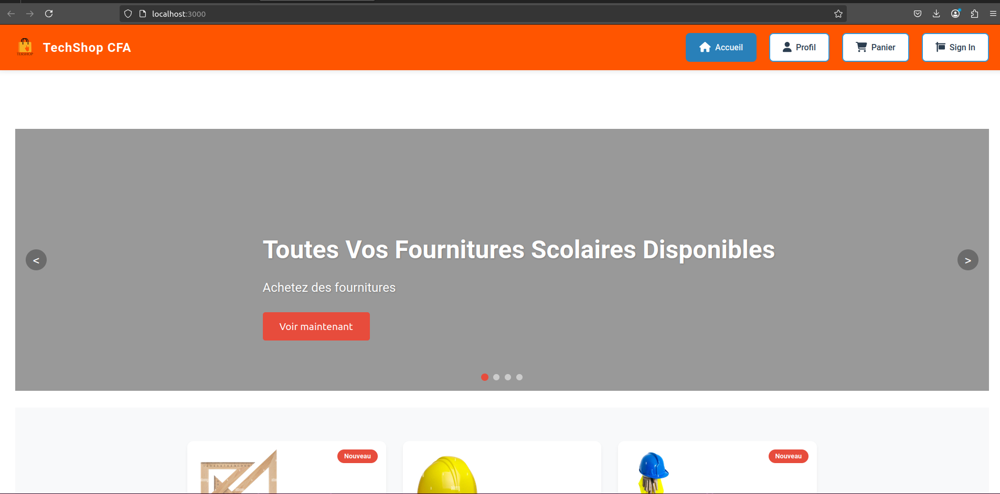
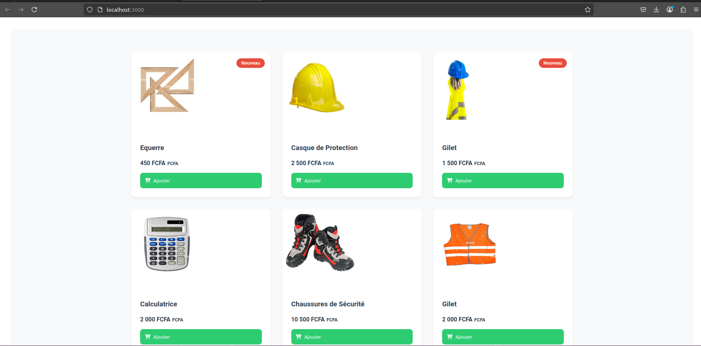
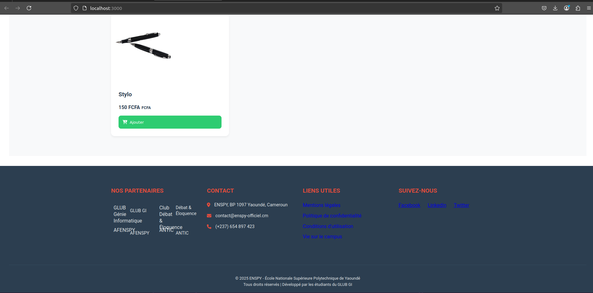
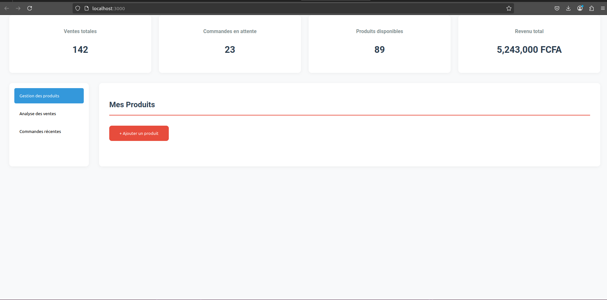
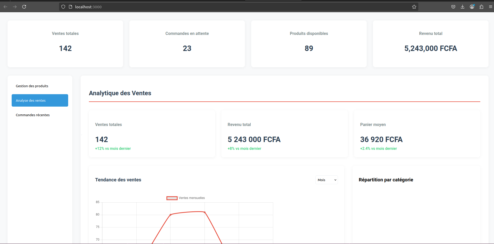
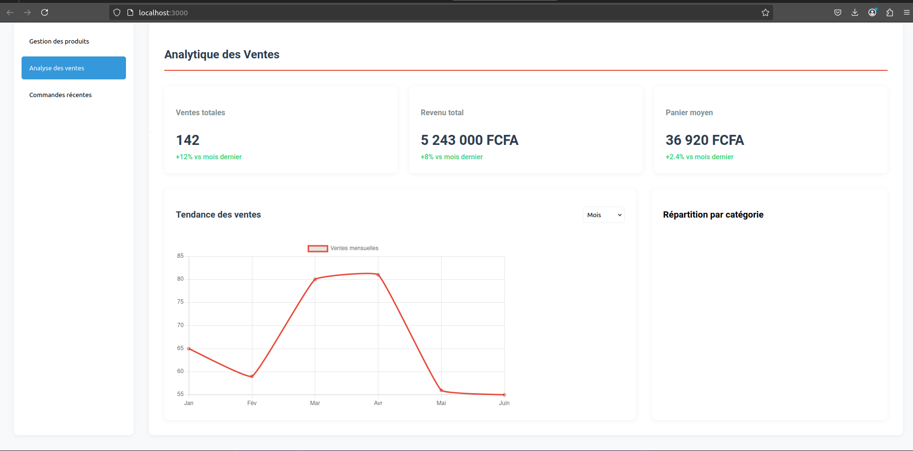
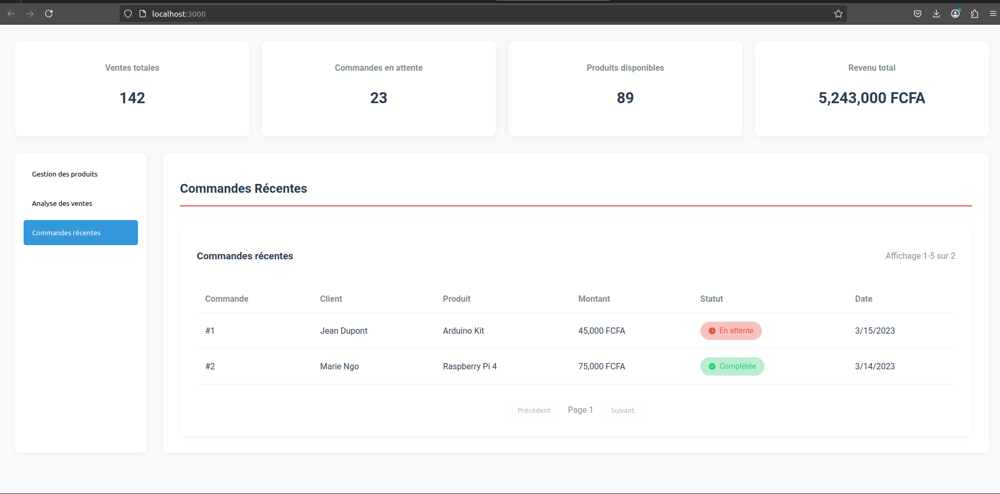

# DESCRIPTION

Notre Projet, nommé __TEKShop__ est une application web qui permet aux étudiants et personnels d'un établissement de vendre et d'acheter des produits.L'application est développée avec React et utilise des composants pour afficher les produits, les détails des produits et les formulaires de connexion.

# FONCTIONALITÉS

Affichage des produits avec des images et des descriptions
Formulaire de connexion pour les vendeurs
Navigation entre les pages de produits et les détails des produits
Utilisation de React Router pour gérer les routes de l'application

# TECHNOLOGIES

React: la bibliothèque JavaScript pour développer des applications web
React Router: la bibliothèque pour gérer les routes de l'application
CSS: le langage de style pour définir l'apparence de l'application

# INSTALLATION

1. Cloner le dépôt Git du projet
2. Installer les dépendances avec ```npm install```
3. Lancer l'application avec ```npm start```

# PRÉSENTATION SOMMAIRE








